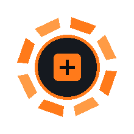
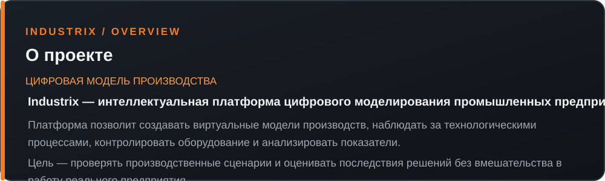
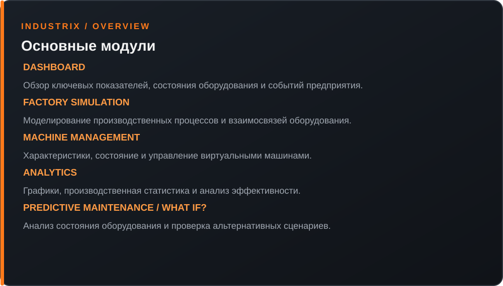
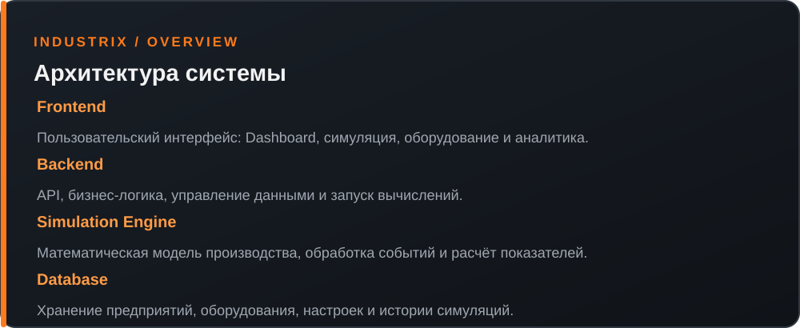
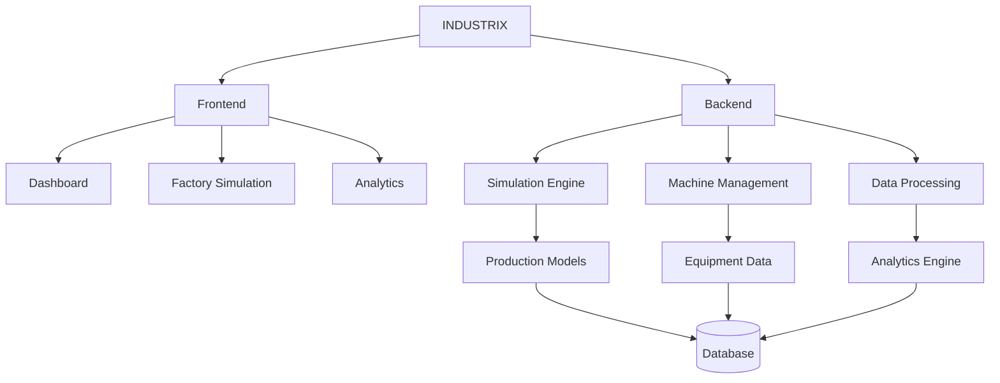
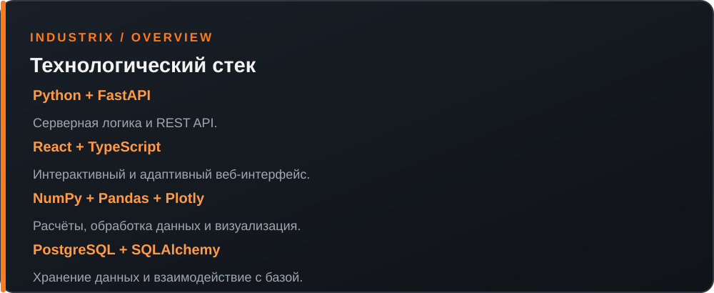
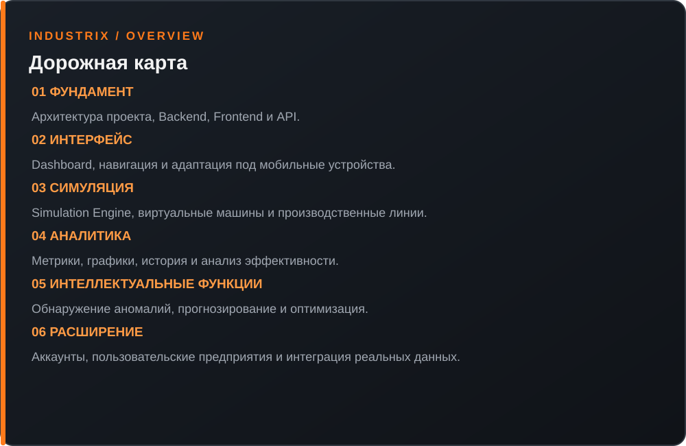
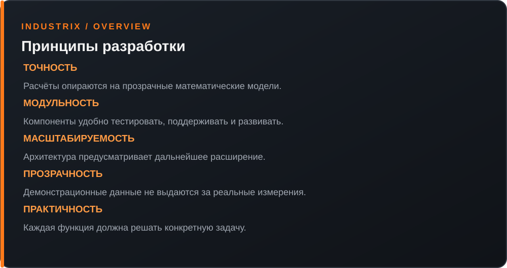
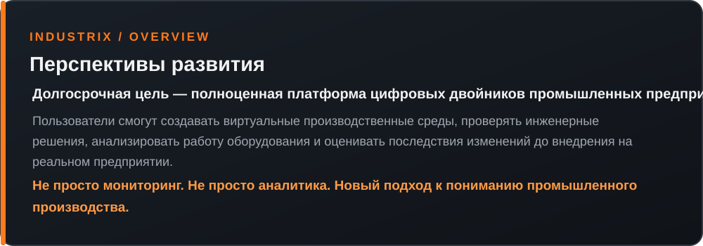

 

 

---

### Схема взаимодействия компонентов

```mermaid
flowchart TD
    A["INDUSTRIX"] --> B["Frontend"]
    A --> C["Backend"]
    B --> D["Dashboard"]
    B --> E["Factory Simulation"]
    B --> F["Analytics"]
    C --> G["Simulation Engine"]
    C --> H["Machine Management"]
    C --> I["Data Processing"]
    G --> J["Production Models"]
    H --> K["Equipment Data"]
    I --> L["Analytics Engine"]
    J --> M[("Database")]
    K --> M
    L --> M
```

---

**INDUST RIX**

Моделируй. Анализируй. Оптимизируй.

Создаём будущее промышленной аналитики.

  

